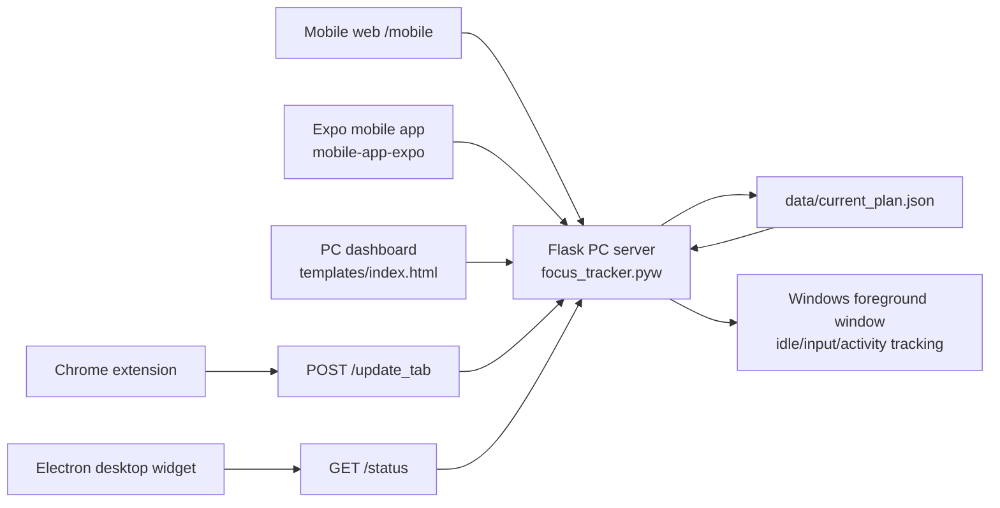

# FocusPlan ADHD Focus Tracker

FocusPlan is a local-first ADHD focus support prototype that connects a mobile planner, a PC execution dashboard, a Chrome tab watcher, and an always-on-top desktop widget.

The product goal is simple: help a user turn a vague task into small executable steps, start those steps on the PC, notice blocked distractions or overtime, and end with a useful focus report.

## Product PRD

### Problem

People with ADHD often do not fail because they lack intention. They fail at the handoff between intention and action:

- A task feels too large to start.
- Planning happens in one place, but execution happens somewhere else.
- The user drifts into blocked apps or sites without noticing.
- When time runs out, the system should support transition instead of adding another disruptive modal.
- A useful report should summarize the whole plan, not only one task fragment.

### Product Thesis

FocusPlan separates planning from execution:

- Mobile is for creating and editing the plan.
- PC is for starting and monitoring the plan.
- Widget is for low-friction task visibility during work.
- Chrome extension is for browser URL context.
- Local JSON is the handoff layer between surfaces.

### Target Users

- Students working on reports, exams, research, or presentations.
- Knowledge workers who need small task chunks and gentle time boundaries.
- ADHD users who benefit from visible next actions and low-friction recovery cues.

### Core User Journey

1. The user opens the mobile planner and describes a large goal.
2. The mobile app turns the goal into micro steps.
3. The user optionally sets blocked apps/sites and allows PC metadata collection.
4. The plan is sent to the local PC server and stored in `data/current_plan.json`.
5. The PC dashboard reads the plan and displays a desktop shell with the steps as the main content.
6. The user starts the plan.
7. The tracker activates the first step, records focus/idle/distraction time, and exposes status through `/status`.
8. The user moves through tasks using "Next Task".
9. On the last task, the user finishes and sees a whole-plan report.
10. The widget can remain visible while the user works, polling the local status API.

### MVP Feature Scope

Implemented:

- Mobile plan creation through the Flask mobile page and Expo app.
- Shared plan storage in `data/current_plan.json`.
- PC web dashboard at `http://localhost:5000`.
- PC plan launcher and step progression.
- Focus/idle/window-switch tracking on Windows.
- Blocked app and blocked site detection.
- Chrome extension endpoint for active tab URL/title updates.
- Whole-plan report totals across multiple steps.
- Hidden warning overlay with overrun audio cue via `static/audio/transition-rain.mp3`.
- Desktop widget launch/stop/status API.
- Electron widget with `/status` polling and mock fallback.

Out of scope or still rough:

- Production auth, accounts, sync, and cloud storage.
- Cross-platform OS monitoring beyond Windows APIs.
- Full packaged installer.
- Strong schema validation at every API boundary.
- Polished text encoding in some legacy comments/demo strings.
- Secure LAN/mobile pairing. Current development mode trusts local network access.

### Success Criteria

- A first-time developer can run the PC app, mobile app, and widget locally.
- A user can create a plan on mobile and see it on PC.
- Starting a plan updates task state from `pending` to `active`.
- Completing a task advances to the next pending task.
- `/status` can drive both the PC dashboard and widget.
- Reports summarize the full plan session.

## Architecture



### Runtime Surfaces

| Surface | Location | Purpose |
| --- | --- | --- |
| PC Flask app | `focus_tracker.pyw` | Main local server, tracker engine, dashboard API, widget launcher |
| PC dashboard | `templates/index.html` | Desktop shell, plan start, task progress, status, report |
| Mobile web | `templates/mobile.html` + `mobile_app.py` | Browser-based mobile planner served by Flask |
| Expo mobile app | `mobile-app-expo/App.tsx` | Native/mobile-style planner and dashboard |
| Desktop widget | `desktop-widget/src/*` | Always-on-top companion window |
| Chrome extension | `chrome-extension/*` | Sends active Chrome URL/title to the PC server |
| Shared plan file | `data/current_plan.json` | Current cross-surface plan state |
| Shared schema | `shared/plan_schema.json` | Reference structure for a plan |

## Repository Map

```text
.
├── focus_tracker.pyw              # Main Flask app and Windows focus tracker
├── mobile_app.py                  # Flask blueprint for mobile plan APIs/pages
├── templates/
│   ├── index.html                 # PC dashboard UI
│   └── mobile.html                # Flask-served mobile planner
├── mobile-app-expo/
│   ├── App.tsx                    # Expo React Native mobile app
│   └── package.json               # Expo scripts/dependencies
├── desktop-widget/
│   ├── src/main.js                # Electron main process
│   ├── src/renderer.js            # Widget UI/status polling
│   ├── src/preload.js             # Electron preload bridge
│   └── src/config/widgetConfig.json
├── chrome-extension/
│   ├── manifest.json
│   └── background.js              # Sends tab info to /update_tab
├── shared/
│   ├── plan_schema.json
│   └── example_plan.json
├── static/audio/transition-rain.mp3
├── data/current_plan.json         # Runtime state, not a source-of-truth fixture
├── DESIGN.md                      # Visual design guidance
└── DEMO.md                        # Older demo notes; README is the canonical overview
```

## Core Data Model

The current plan is stored at:

```text
data/current_plan.json
```

Canonical shape:

```json
{
  "plan_id": "plan-abc123",
  "goal_title": "Write midterm report",
  "created_at": "2026-05-19T20:00:00+09:00",
  "total_minutes": 45,
  "metadata_permission": true,
  "blocked_apps": ["KakaoTalk.exe"],
  "blocked_sites": ["youtube.com"],
  "status": "draft",
  "current_step_index": 0,
  "source": "mobile",
  "steps": [
    {
      "id": "step_1",
      "title": "Open document and write title",
      "duration_minutes": 5,
      "category": "WORK",
      "status": "pending",
      "order": 1
    }
  ]
}
```

Step statuses:

- `pending`: ready but not started.
- `active`: current task being monitored.
- `completed`: finished.
- `skipped`: reserved in schema, not a primary UI path yet.

Plan statuses:

- `draft`: created but not running.
- `active`: tracker is running a step.
- `completed`: all steps are complete.

## Main APIs

### Pages

| Method | Path | Purpose |
| --- | --- | --- |
| `GET` | `/` | PC dashboard |
| `GET` | `/mobile` | Flask-served mobile planner |

### Plan APIs

| Method | Path | Purpose |
| --- | --- | --- |
| `GET` | `/api/plan/current` | Read `data/current_plan.json` |
| `POST` | `/api/plan/start` | Start first pending/current plan step |
| `POST` | `/api/tasks/complete_current` | Complete active task and move to next |
| `POST` | `/api/mobile/plan` | Create or normalize a mobile plan |
| `GET` | `/api/mobile/latest_plan` | Get latest mobile plan |
| `POST` | `/api/mobile/step_done` | Mark one mobile step done/pending |
| `POST` | `/api/mobile/start_plan` | Start a mobile-selected plan through the tracker |

### Tracking APIs

| Method | Path | Purpose |
| --- | --- | --- |
| `POST` | `/start_tracking` | Legacy/manual tracking start |
| `POST` | `/stop_tracking` | Stop tracking and return report |
| `GET` | `/status` | Current focus state, task state, timing, progress |
| `POST` | `/allowed_apps_preview` | Legacy allowed-app preview helper |
| `POST` | `/update_tab` | Chrome extension sends current URL/title |

### Widget APIs

| Method | Path | Purpose |
| --- | --- | --- |
| `POST` | `/widget/start` | Launch Electron widget or fallback widget |
| `POST` | `/widget/stop` | Stop widget process |
| `GET` | `/widget/status` | Check whether widget is running |

## `/status` Response

The PC dashboard and widget both rely on `/status`. Important fields include:

```json
{
  "is_active": true,
  "state": "focused",
  "state_code": "focused",
  "reason": "",
  "goal_title": "Write report",
  "current_task": {
    "id": "step_1",
    "title": "Open document",
    "duration_minutes": 5,
    "status": "active",
    "order": 1
  },
  "next_task": null,
  "plan_steps": [],
  "plan_progress": {
    "completed": 0,
    "total": 5,
    "percent": 0
  },
  "metadata_permission": true,
  "blocked_apps": [],
  "blocked_sites": ["youtube.com"],
  "remaining_time": 240,
  "overrun_seconds": 0,
  "transition_phase": "work",
  "current_app": "chrome.exe",
  "current_url": "https://example.com",
  "activity": 12,
  "idle_time": 0,
  "window_switch": 2
}
```

State codes:

- `focused`: normal work.
- `warning`: close to the end of the task.
- `distracted`: blocked app/site or overtime.
- `idle`: input idle threshold exceeded when metadata checks are enabled.
- `completed`: whole plan complete.
- `collecting`: initial/default state.

Transition phases:

- `work`: normal task time.
- `wrapup_soon`: approaching the end.
- `finish_now`: final wrap-up window.
- `overrun`: target time exceeded; natural audio cue should play in the PC dashboard.

## Focus Detection Logic

The tracker is Windows-specific and uses:

- `ctypes.windll.user32` for foreground window, title, process, and idle information.
- `pynput` for keyboard and mouse input events.
- `psutil` for process lookup and widget process management.
- A polling loop that updates state every second.

Detection inputs:

- Active foreground process.
- Active foreground window title.
- Chrome URL/title from the extension.
- Idle time.
- Activity count.
- Window switch count.
- Blocked apps/sites configured in the current plan.

Current product decision:

- Inferred allowed-app detection is disabled for enforcement.
- Distracted state is primarily reserved for blocked apps/sites and overtime.
- Metadata permission controls idle-related checks.

## Reports

`POST /stop_tracking` returns a session report. For multi-step plans, the server accumulates step-level data into the plan's `report_totals` and returns a whole-plan view:

- Focus seconds.
- Distracted seconds.
- Idle seconds.
- Target minutes.
- Elapsed seconds.
- Overrun seconds.
- Unique distractions.

The PC dashboard renders this as a dashboard-style report rather than one report per task.

## Setup

### Requirements

- Windows.
- Python 3.10+.
- Node.js and npm.
- Chrome if using blocked-site detection.
- Expo Go or a simulator if using the Expo mobile app.

Python packages used by the app:

- `flask`
- `psutil`
- `pynput`

Install them if missing:

```powershell
pip install flask psutil pynput
```

Install widget dependencies:

```powershell
cd desktop-widget
npm install
```

Install Expo mobile dependencies:

```powershell
cd mobile-app-expo
npm install
```

## Running The App

### 1. Start the PC Flask app

From the repository root:

```powershell
python focus_tracker.pyw
```

Open:

```text
http://localhost:5000
```

The Flask server binds to `0.0.0.0:5000`, so phones on the same LAN can reach it by using the PC's LAN IP.

### 2. Use the Flask mobile planner

```text
http://localhost:5000/mobile
```

This is the simplest mobile planning path because it is served by the same Flask app.

### 3. Run the Expo mobile app

```powershell
cd mobile-app-expo
npm start -- --host lan
```

In Expo Go, connect to the LAN URL shown by Expo. In the app's server field, use:

```text
http://<PC_LAN_IP>:5000
```

Example:

```text
http://192.168.0.10:5000
```

### 4. Run the desktop widget directly

```powershell
cd desktop-widget
npm start
```

Or use the PC dashboard's widget controls, which call:

```text
POST /widget/start
POST /widget/stop
```

### 5. Enable the Chrome extension

1. Open Chrome Extensions.
2. Enable Developer Mode.
3. Load unpacked extension from `chrome-extension/`.
4. Keep the PC Flask server running.

The extension posts active tab changes to:

```text
http://localhost:5000/update_tab
```

## Development Commands

Check Python syntax:

```powershell
python -m py_compile focus_tracker.pyw mobile_app.py desktop_widget_fallback.py
```

Check widget JavaScript:

```powershell
cd desktop-widget
npm run check
```

Run Expo:

```powershell
cd mobile-app-expo
npm start
```

Run Expo web:

```powershell
cd mobile-app-expo
npm run web
```

## Implementation Notes

### Local-first state

This project intentionally keeps current state in local files and memory. The key file is `data/current_plan.json`. It is useful for demos but should be treated as runtime state, not as a canonical fixture.

### Widget runtime directories

Electron sessions create `widget-runtime/session-*` directories. These are runtime artifacts and should not be hand-edited.

### Cache and logs

Common runtime artifacts:

- `__pycache__/`
- `desktop-widget/electron-crash.log`
- `desktop-widget/widget-launch.log`
- `mobile-expo.log`
- `data/*.log`
- `widget-runtime/session-*`

### Design system

`DESIGN.md` contains visual direction. The PC dashboard currently uses a desktop shell layout:

- Left sidebar.
- Central plan title and steps.
- Right-side support panels.
- Compact desktop density.
- Hidden disruptive warning overlay.
- Audio-only overtime cue.

## Known Limitations

- The codebase is a prototype and has some legacy mojibake text in comments and older UI strings.
- `DEMO.md` may be stale in places. Prefer this README for current architecture.
- The Expo app has a hardcoded LAN fallback in `App.tsx`; the in-app server input should be used when the PC LAN IP differs.
- Widget task data still has mock fallback behavior.
- Chrome URL detection only works when the extension is loaded and allowed to call localhost.
- Windows focus APIs require a normal interactive desktop session.
- There is no authentication on local APIs.
- `.gitignore` is currently minimal; avoid committing runtime logs/session folders unless intentionally updating repository hygiene.

## Roadmap

Near-term:

- Add a proper `.gitignore` for runtime logs, cache, and widget sessions.
- Normalize text encoding across legacy files.
- Add schema validation for plan writes.
- Add a single launcher script for PC + mobile dev servers.
- Improve mobile LAN discovery and pairing.
- Wire widget task completion directly to `/api/tasks/complete_current`.

Mid-term:

- Package the Windows app.
- Add persisted historical reports.
- Add user-controlled notification/audio settings.
- Add richer report charts and weekly statistics.
- Add tests for plan progression and report totals.

Long-term:

- Cloud sync or encrypted local sync.
- Cross-platform desktop monitoring.
- Real account model and secure device pairing.
- Personalizable ADHD support profiles.

## Quick Demo Script

1. Start `python focus_tracker.pyw`.
2. Open `http://localhost:5000/mobile` or the Expo app.
3. Create a goal and generate steps.
4. Send the plan to PC.
5. Open `http://localhost:5000`.
6. Confirm the plan appears in the PC dashboard.
7. Start the plan.
8. Use "Next Task" to advance through steps.
9. Let a short task overrun to confirm the natural audio cue.
10. Finish the last task and view the whole-plan report.

## Ownership

This is a single-machine prototype focused on ADHD-friendly planning and execution. The strongest current path is local demo and iteration, not production deployment.
